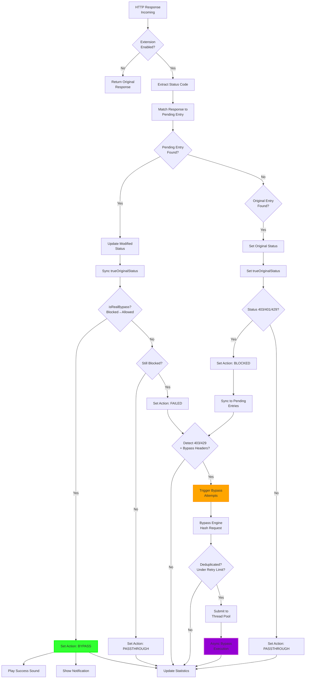

# Sala7-Bypass


## Introduction

Access control mechanisms are the gatekeepers of modern web applications. They decide who can access what resources, when, and under what conditions. Yet these very mechanisms, when improperly implemented, become the weakest links in an otherwise robust security posture.

The HTTP status codes **403 Forbidden**, **401 Unauthorized**, and **429 Too Many Requests** represent the primary signals that an access control boundary has been enforced. But what happens when these boundaries can be circumvented? The answer is simple: unauthorized data access, privilege escalation, and complete system compromise.

OWASP consistently ranks **Broken Access Control** as the #1 web application security risk. In 2023 alone, access control bypasses constituted **18% of all critical-severity reports** on HackerOne, with median bounties reaching **$4,500** for authentication bypasses. The business impact is equally severe: the average data breach costs **$4.45 million**, with regulatory penalties under GDPR reaching **4% of global revenue**.

Despite this prevalence, systematic testing for access control bypasses remains inconsistently implemented. Manual testing—sending individual requests with modified headers in Burp Repeater—is time-consuming, error-prone, and fails to achieve comprehensive coverage. A typical application with 200+ endpoints, each potentially vulnerable to 40+ header injection vectors, 2 method switching variants, and 3 authentication removal combinations, requires testing **27,000 request variants**. Manual testing of this scale is simply impractical.

This is where **Sala7-Bypass** enters the picture.

---

## The Problem with Manual Testing

Before Sala7-Bypass, penetration testers faced a fragmented landscape of tools and techniques:

### Table

| Tool | What It Does | What's Missing |
| --- | --- | --- |
| **AutoRepeater** | Automated request replay | No intelligent response analysis; complex setup for 40+ headers |
| **Burp Repeater** | Manual request modification | One request at a time; no batch processing |
| **Custom Python Scripts** | Specific bypass vectors | No Burp integration; no UI; no statistics |
| **Burp Scanner** | Heuristic access control checks | No configurable header pool; no per-technique tracking |

The consistent pattern? **Specialization without integration**. Each tool addresses a subset of bypass techniques, but none provides the unified, configurable, and observable platform that comprehensive testing demands.

---

## What is Sala7-Bypass?

**Sala7-Bypass** is a Burp Suite Professional extension designed specifically for systematic, comprehensive, and observable **403/401/429 bypass testing**. Built on PortSwigger's modern **Montoya API**, it integrates natively into Burp's proxy, repeater, and intruder workflows while providing capabilities that no existing tool offers in unified form.

### Design Philosophy

1. **Comprehensive Coverage**: Test all major bypass vectors—IP spoofing (40+ headers), method switching (GET↔POST with parameter migration), authentication removal (Cookie/Authorization), path manipulation (X-Original-URL/X-Rewrite-URL), and rate limiting bypass (IP rotation)—within a single interface.
2. **Intelligent Automation**: Automatically detect successful bypasses by comparing original and modified response statuses, classify bypass types, track per-technique success rates, and adapt behavior based on configuration.
3. **Transparent Observability**: Every request, every modification, every response, and every bypass decision is visible, logged, color-coded, and exportable. You understand not just *that* a bypass succeeded, but *how*, *which technique*, *which headers*, and *with what success rate*.

---

## Architecture & Design

### Modular Architecture

Sala7-Bypass implements a **six-class architecture** with strict separation of concerns:

### Table

| Class | Responsibility | Key Features |
| --- | --- | --- |
| **BurpExtender** | Interception & coordination | HTTP/Proxy handler registration, lifecycle management |
| **BypassEngine** | State & logic engine | Request deduplication, retry tracking, success memoization |
| **RequestModifier** | Stateless transformations | Method switching, header addition/removal |
| **LogEntry** | Immutable data structure | Complete request/response lifecycle capture |
| **LogTableModel** | Swing data binding | Table model, statistics computation |
| **BypassExtensionUI** | Presentation & interaction | Five tabs, color-coded renderers, export functionality |

### Data Flow

```python
[Browser/Tool] → [Burp HTTP Stack] → [BurpExtender.handleHttpRequestToBeSent()]
                                              ↓
                                    [RequestModifier] (transformations)
                                    [BypassEngine] (state checks)
                                              ↓
                                    [LogEntry] (immutable data capture)
                                              ↓
                                    [Burp Server] → [Response]
                                              ↓
                                    [BurpExtender.handleHttpResponseReceived()]
                                              ↓
                                    [BypassEngine] (success evaluation)
                                    [LogEntry] (status updates)
                                              ↓
                                    [LogTableModel] (data binding)
                                    [BypassExtensionUI] (rendering)
```

### Thread Safety

Operating within Burp's multi-threaded environment, Sala7-Bypass ensures thread safety through:

### Table

| Data Structure | Mechanism | Purpose |
| --- | --- | --- |
| `logEntries` | `CopyOnWriteArrayList` | Append-only log storage; lock-free reads |
| `pendingEntries` | `ConcurrentHashMap` | Request-response matching; atomic put/remove |
| `bypassEngine` state | `ConcurrentHashMap` | Deduplication, retry counting, success tracking |
| `ExecutorService` | Fixed thread pool | Async bypass attempts without blocking Burp |

---

## Core Features Deep Dive

### 1. Request Interception Engine

Sala7-Bypass intercepts all HTTP traffic through Burp's **Montoya API**, applying a sequential decision pipeline:

**Gate 1: Extension Enabled** → **Gate 2: Scope Restriction** → **Gate 3: Loop Prevention** → **Gate 4: Auth Filter** → **Gate 5: Content-Type Filter** → **Transformation Pipeline**

Each gate implements early-exit logic, minimizing performance impact for traffic that should not be processed.

### 2. Response Analysis Engine

When responses return, the engine:

1. **Correlates** responses with pending requests using deterministic keys
2. **Detects** blocking codes (401/403/429)
3. **Classifies** bypass success by comparing original vs modified status
4. **Triggers** automatic bypass attempts for blocked responses

### 3. Bypass Attempt Engine

For each blocked response, the engine:

1. **Hashes** the request for deduplication
2. **Checks** retry limits and previous success
3. **Iterates** through bypass header sets
4. **Applies** method switching and auth removal (if configured)
5. **Sends** bypass requests asynchronously
6. **Logs** results with full metadata

---

## Bypass Techniques Implementation

### 3.1 IP Spoofing Bypass

The most prevalent bypass vector, exploiting applications that derive client identity from HTTP headers rather than transport-layer connections.

**40+ Header Pool:**

### Table

| Header Category | Examples | Count |
| --- | --- | --- |
| Standard forwarding | `X-Forwarded-For`, `X-Real-IP` | 2 |
| Platform-specific | `CF-Connecting-IP`, `True-Client-IP` | 2 |
| Generic alternatives | `X-Client-IP`, `X-Originating-IP` | 37+ |
| Custom variants | `X-Custom-IP-Authorization` | 1 |

**IP Encoding Variants:**

### Table

| Encoding | Example | Use Case |
| --- | --- | --- |
| Standard IPv4 | `127.0.0.1` | Baseline |
| IPv6 | `::1` | IPv6-enabled apps |
| Hexadecimal | `0x7f000001` | Hex-parsing apps |
| Decimal | `2130706433` | Integer-parsing apps |
| Shortened | `127.1` | Poor parsing implementations |
| Octal | `0177.0.0.1` | Octal-parsing legacy systems |

**Implementation:**

```python
private static List<Map<String, String>> generateBypassHeaders() {
    List<Map<String, String>> headersList = new ArrayList<>();
    for (String ip : IP_VALUES) {
        headersList.add(Map.of("X-Forwarded-For", ip));
        headersList.add(Map.of("X-Real-IP", ip));
        // ... 40+ headers ...
    }
    return headersList;
}
```

### 3.2 HTTP Method Switching

Exploits method-bound access controls by switching GET↔POST with automatic parameter migration.

**GET → POST Conversion:**

- Extracts URL parameters (`?key=value`)
- Migrates to request body (`key=value`)
- Adds `Content-Type: application/x-www-form-urlencoded`
- Removes query string from URL

**POST → GET Conversion:**

- Extracts body parameters
- Migrates to URL query string (`?key=value`)
- Clears request body
- Removes `Content-Type` header

**Implementation:**

```python
public static HttpRequest switchMethod(HttpRequest request) {
    String method = request.method();
    if (method.equalsIgnoreCase("GET")) {
        return convertGetToPost(request);
    } else if (method.equalsIgnoreCase("POST")) {
        return convertPostToGet(request);
    }
    return request;
}
```

### 3.3 Authentication Header Removal

Tests "fail-open" behaviors where missing authentication grants access rather than denying it.

**Selective Removal:**

### Table

| Toggle | Removes | Tests For |
| --- | --- | --- |
| `removeCookie` | `Cookie` header | Session-less access, debug endpoints |
| `removeAuthorization` | `Authorization` header | Token-less API access, legacy fallbacks |

**Hierarchical Control:**

```python
removeAuth (master toggle)
    ├── removeCookie (subordinate)
    └── removeAuthorization (subordinate)
```

This enables pre-configuration: set subordinate toggles, then enable/disable all auth removal with a single click.

### 3.4 Path-Based Bypass

Exploits path normalization discrepancies between reverse proxies and application servers.

**Headers Tested:**

### Table

| Header | Purpose |
| --- | --- |
| `X-Original-URL` | Original request path before proxy rewriting |
| `X-Rewrite-URL` | Alternative path specification |

When the proxy routes based on the actual request path but the application authorizes based on the header-specified path, injecting an allowed path bypasses restrictions.

### 3.5 Rate Limiting Bypass

Circumvents per-IP rate limiting through IP rotation.

**Strategy:**

### Table

| Approach | Implementation | Effectiveness |
| --- | --- | --- |
| Single IP rotation | Change `X-Forwarded-For` per request | High against naive per-IP counters |
| Multi-hop chains | `X-Forwarded-For: 1.1.1.1, 2.2.2.2` | High against chain-parsing implementations |
| Distributed delays | Configurable `requestDelay` | Avoids pattern detection |

**Rate Limit Tracking:**

```python
private final Map<String, Integer> retryCount = new ConcurrentHashMap<>();

public boolean shouldBypass(String requestHash, int maxRetries) {
    if (hasSuccess(requestHash)) return false;
    if (getRetryCount(requestHash) >= maxRetries) return false;
    return true;
}
```

### 3.6 Combined Attack Vectors

Applies multiple techniques simultaneously for layered protection bypass.

**Scoring System:**

### Table

| Technique | Points | Detection |
| --- | --- | --- |
| IP spoofing | 1 | `X-Forwarded-For` present and valid |
| Method switch | 1 | GET instead of blocked POST |
| Auth removal | 1 | No `Authorization` or `Cookie` |

**Success Condition:** 2+ points (bypassing layered but independently flawed controls)

---

## User Interface & Experience

### Tabbed Interface (5 Tabs)

### Table

| Tab | Purpose | Key Components |
| --- | --- | --- |
| **Controls** | Master configuration | Enable/disable, scope, filters, modifications |
| **Live Logs** | Real-time monitoring | 7-column table, statistics panel, detail view |
| **Advanced** | Fine-tuning | Threads, delays, auto-stop, sound file |
| **Payloads** | Custom header management | 750+ default headers, editable table, import/export |
| **About** | Attribution | Developer info, dedication |

### Live Logging System

**7-Column Table:**

### Table

| Column | Width | Renderer | Purpose |
| --- | --- | --- | --- |
| Time | 60px | Default | Interception timestamp |
| URL | 350px | Default | Full request URL |
| Status | 50px | **StatusCellRenderer** | Color-coded HTTP status |
| Method | 60px | Default | Modified HTTP method |
| Action | 90px | **ResultCellRenderer** | Bypass classification |
| Bypass Type | 120px | **BypassTypeCellRenderer** | Technique badge |
| Time(ms) | 60px | Default | Response time |

### Interactive Features

### Table

| Feature | Trigger | Action |
| --- | --- | --- |
| **View Details** | Right-click → "View Details" | Enhanced request/response viewer |
| **Send to Repeater** | Right-click → "Send to Repeater" | Transfer modified request to Burp Repeater |
| **Send to Intruder** | Right-click → "Send to Intruder" | Transfer modified request to Burp Intruder |
| **Copy URL** | Right-click → "Copy URL" | Clipboard copy |
| **Copy cURL** | Right-click → "Copy as cURL" | Command-line reconstruction |
| **Copy Bypass Info** | Right-click → "Copy Bypass Info" | Detailed bypass report |
| **Delete Row** | Right-click → "Delete Row" or `Delete` key | Remove log entry |
| **Keyboard Shortcuts** | `Delete`, `Ctrl+C` | Quick row manipulation |

### Enhanced Request/Response Viewer

Double-click any row to open a **1600×1000 dialog** with:

- **Left Panel**: Request inspection (Original/Modified toggle, Raw/Pretty/Diff tabs)
- **Right Panel**: Response inspection (Original/Modified/Bypass selector, Pretty/Raw/Hex tabs)
- **Bottom Panel**: Quick modifications (GET↔POST, No Cookie, No Auth, Bypass Headers toggles), status info, action buttons (Send, Replay, Repeater, Copy, Close)

---

## Statistics & Visual Feedback

### Statistics Dashboard

**Real-time computation** on every log update:

### Table

| Metric | Formula | Display |
| --- | --- | --- |
| **Total** | `logEntries.size()` | `Total: 1542` |
| **Blocked** | Count where `trueOriginalStatus ∈ {401,403,429}` | `Blocked: 287` |
| **Bypass** | Count where `isRealBypass() == true` | `Bypass: 43` |
| **Rate** | `(Bypass / Blocked) × 100` | `Rate: 15.0%` |
| **Method** | Count where `bypassType == "METHOD"` | `M: 12` |
| **Header** | Count where `bypassType == "HEADER"` | `H: 18` |
| **Auth** | Count where `bypassType == "AUTH"` | `A: 8` |

**Color Feedback:**

- `Bypass > 0`: Labels turn **bright green** (`#32FF32`)
- `Bypass = 0`: Labels remain **white**

### Visual Color Coding

**Status Codes:**

### Table

| Code | Background | Foreground | Meaning |
| --- | --- | --- | --- |
| 200-299 | Light green `#90EE90` | Dark green `#006400` | Success / Bypass achieved |
| 301-302 | Orange `#FFC864` | Dark orange `#965000` | Redirect / Partial success |
| 401, 403, 429 | Light red `#FF9696` | Dark red `#960000` | Blocked / Access denied |
| 500+ | Light red `#FFB4B4` | Dark red `#960000` | Server error |

**Bypass Type Badges:**

### Table

| Type | Color | Hex | Example |
| --- | --- | --- | --- |
| METHOD | Cornflower blue | `#6495ED` | `METHOD (GET→POST)` |
| HEADER | Medium sea green | `#3CB371` | `HEADER (X-Forwarded-For)` |
| AUTH | Orchid | `#DA70D6` | `AUTH (Removed)` |
| RATE_LIMIT | Orange | `#FFA500` | `RATE_LIMIT (429→200)` |
| COMBINED | Dark violet | `#9400D3` | `COMBINED (Multi)` |

## Configuration & Customization

### Controls Tab

### Table

| Setting | Default | Range | Purpose |
| --- | --- | --- | --- |
| Extension Enabled | `true` | boolean | Master on/off switch |
| Scope Only | `true` | boolean | Restrict to Burp scope |
| Loop Prevention | `true` | boolean | Prevent recursive processing |
| Method Switching | `false` | boolean | GET↔POST conversion |
| Remove Auth | `false` | boolean | Master auth removal toggle |
| Remove Cookie | `false` | boolean | Strip `Cookie` header |
| Remove Authorization | `false` | boolean | Strip `Authorization` header |
| Detect 403/429 | `true` | boolean | Trigger bypass on blocking codes |
| Inject Bypass Headers | `true` | boolean | Enable header injection pool |
| Single Header Mode | `false` | boolean | One header vs. all headers |
| Max Retries | `3` | 1-20 | Attempts per unique request |

### Advanced Tab

### Table

| Setting | Default | Range | Purpose |
| --- | --- | --- | --- |
| Concurrent Threads | `5` | 1-50 | Parallel bypass workers |
| Request Delay | `0` | 0-10000ms | Throttling between attempts |
| Auto-Stop on Success | `false` | boolean | Halt after first bypass |
| Sound File Path | Windows path | file path | Success notification audio |
| Bypass Method Switch | `false` | boolean | Method switch in bypass attempts |
| Bypass Auth Removal | `false` | boolean | Auth removal in bypass attempts |

### Payloads Tab

**Default Pool:** 750+ header combinations across 5 categories

**Operations:**

- **Add**: Custom header-value pair
- **Remove**: Delete selected row
- **Clear**: Empty all entries
- **Reset**: Restore default 750+ pool
- **Save**: Export to JSON file
- **Load**: Import from JSON file

---

## Data Export & Reporting

### CSV Export

**Column Structure:**

```python
Time,URL,OriginalMethod,ModifiedMethod,OriginalStatus,ModifiedStatus,Action,BypassType,Bypass,RealBypass,Success,ResponseTime,BypassDetails
```

**Escaping Rules:**

- URLs enclosed in double quotes
- Double quotes escaped as `""`
- Newlines normalized to spaces

### JSON Export

**Schema:**

```python
[
  {
    "timestamp": "14:32:17",
    "url": "https://example.com/admin",
    "originalMethod": "GET",
    "modifiedMethod": "POST",
    "originalStatus": 403,
    "modifiedStatus": 200,
    "action": "BYPASS",
    "bypassType": "METHOD",
    "isBypass": true,
    "isRealBypass": true,
    "isSuccess": true,
    "responseTime": 145,
    "bypassDetails": "Original: 403 -> Modified: 200 | GET -> POST | Mods: METHOD_SWITCH:GET->POST"
  }
]
```

### Payload Import/Export

**Format:**

```python
[
  {
    "name": "X-Forwarded-For",
    "value": "127.0.0.1",
    "enabled": true
  }
]
```

---

## Security Considerations

### Loop Prevention

The `X-Burp-Processed: true` header prevents recursive request processing:

- **Injected** in `handleHttpRequestToBeSent()`
- **Checked** before processing and bypass triggering
- **Removed** from bypass attempts before sending

### Request Deduplication

`BypassEngine.hashRequest()` creates deterministic identifiers:

```python
return request.method() + "|" + request.url() + "|" + request.bodyToString().hashCode();
```

Prevents duplicate bypass attempts for identical requests.

### Thread Safety

### Table

| Component | Mechanism |
| --- | --- |
| `logEntries` | `CopyOnWriteArrayList` |
| `pendingEntries` | `ConcurrentHashMap` atomic operations |
| `bypassEngine` | `ConcurrentHashMap` merge operations |
| UI updates | `SwingUtilities.invokeLater()` |

### Resource Cleanup

`ExecutorService` shutdown sequence:

1. `shutdown()` — graceful termination
2. `awaitTermination(5, SECONDS)` — wait for completion
3. `shutdownNow()` — forceful cleanup if timeout exceeded

---

## Future Roadmap

### Table

| Enhancement | Description | Priority |
| --- | --- | --- |
| **HTTP/2 Headers** | `:authority`, `:scheme` pseudo-headers | Medium |
| **Header Case Variation** | `x-forwarded-for` vs `X-Forwarded-For` | Medium |
| **ML-Based Detection** | Response similarity analysis | Low |
| **Automated Reporting** | Direct Jira/Slack integration | Medium |
| **Collaborative Features** | Shared payload repositories | Low |
| **Plugin API** | Custom bypass module interface | High |

---

And before we finish here some flow digrame

### Request Interception Flow (Detailed)

```mermaid
flowchart TD
    A[HTTP Request<br/>Incoming] --> B{Extension<br/>Enabled?}
    
    B -->|No| Z1[Return Original<br/>Request]
    B -->|Yes| C{Scope Only?}
    
    C -->|Yes| D{URL In Scope?}
    C -->|No| E
    
    D -->|No| Z1
    D -->|Yes| E
    
    E --> F{Loop Prevention?}
    F -->|Yes| G{X-Burp-Processed<br/>Header Present?}
    F -->|No| H
    
    G -->|Yes| Z1
    G -->|No| H
    
    H --> I{Auth Filter?}
    I -->|Yes| J{Cookie or<br/>Authorization<br/>Present?}
    I -->|No| K
    
    J -->|No| Z1
    J -->|Yes| K
    
    K --> L{Content-Type<br/>Filter?}
    L -->|Yes| M{Content-Type<br/>Matches?}
    L -->|No| N
    
    M -->|No| Z1
    M -->|Yes| N
    
    N --> O[Apply<br/>Modifications]
    
    subgraph Mods["🔧 Modification Pipeline"]
        O --> P{Method<br/>Switching?}
        P -->|Yes| Q[GET↔POST<br/>Conversion]
        P -->|No| R
        
        Q --> R{Auth<br/>Removal?}
        R -->|Yes| S[Remove Cookie]
        R -->|No| T
        
        S --> U[Remove Authorization]
        T --> V{Loop<br/>Prevention?}
        
        U --> V
        V -->|Yes| W[Add X-Burp-Processed]
        V -->|No| X
        W --> X
    end
    
    X --> Y[Create Log Entry]
    Y --> Z[Register Pending<br/>Original + Modified]
    Z --> AA[Send Modified<br/>Request]
    
    style Mods fill:#16213e,stroke:#7fff00,stroke-width:2px
    style Z1 fill:#ff6b6b,stroke:#ff0000,stroke-width:2px
```





### Response Analysis & Bypass Trigger Flow





### Bypass Attempt Execution Flow

```mermaid
flowchart TD
    A[Bypass Triggered] --> B[Remove Loop<br/>Header]
    
    B --> C{Single Header<br/>Mode?}
    C -->|Yes| D[Use First Header<br/>Set Only]
    C -->|No| E[Iterate All<br/>Header Sets]
    
    D --> F
    E --> F[For Each Header Set]
    
    subgraph Loop["🔄 Bypass Loop"]
        F --> G{Auto-Stop<br/>+ Success?}
        G -->|Yes| Z1[Break Loop]
        G -->|No| H{Attempts >=<br/>Max Retries?}
        
        H -->|Yes| Z1
        H -->|No| I[Apply Bypass<br/>Headers]
        
        I --> J{Bypass Method<br/>Switch?}
        J -->|Yes| K[Switch GET↔POST]
        J -->|No| L
        
        K --> L{Bypass Auth<br/>Removal?}
        L -->|Yes| M[Remove Cookie]
        L -->|No| N
        
        M --> O[Remove Authorization]
        N --> P{Request Delay > 0?}
        
        O --> P
        P -->|Yes| Q[Sleep Delay ms]
        P -->|No| R
        
        Q --> R[Send Request]
        R --> S[Capture Response]
        
        S --> T{Status 200/302?}
        T -->|Yes| U{Original<br/>Blocked?}
        T -->|No| V[Set Bypass: false]
        
        U -->|Yes| W[Set Real Bypass: true]
        U -->|No| V
        
        W --> X[Determine Bypass Type]
        X --> Y[Log Entry + Notify]
        Y --> Z{Auto-Stop?}
        
        Z -->|Yes| Z1
        Z -->|No| AA[Increment Retry]
        
        V --> AA
        AA --> F
    end
    
    Z1 --> AB[Update Statistics]
    
    style Loop fill:#1a1a2e,stroke:#00d4ff,stroke-width:2px
    style W fill:#32ff32,stroke:#00ff00,stroke-width:3px
    style Z1 fill:#ff6b6b,stroke:#ff0000,stroke-width:2px
```




### Statistics Computation Flow

```mermaid
flowchart TD
    A[updateStats<br/>Called] --> B[Initialize Counters]
    
    B --> C[Total = logEntries.size]
    B --> D[Blocked = 0]
    B --> E[Bypass = 0]
    B --> F[Method = 0]
    B --> G[Header = 0]
    B --> H[Auth = 0]
    B --> I[RateLimit = 0]
    B --> J[Combined = 0]
    
    C --> K[For Each LogEntry]
    
    subgraph StatsLoop["📊 Statistics Loop"]
        K --> L{trueOriginalStatus<br/>403/401/429?}
        L -->|Yes| M[Blocked++]
        L -->|No| N
        
        M --> O{isRealBypass?}
        N --> O
        
        O -->|Yes| P[Bypass++]
        O -->|No| Q
        
        P --> R{Switch bypassType}
        R -->|METHOD| S[Method++]
        R -->|HEADER| T[Header++]
        R -->|AUTH| U[Auth++]
        R -->|RATE_LIMIT| V[RateLimit++]
        R -->|COMBINED| W[Combined++]
        
        S --> Q
        T --> Q
        U --> Q
        V --> Q
        W --> Q
    end
    
    Q --> X{More Entries?}
    X -->|Yes| K
    X -->|No| Y[Rate = Bypass/Blocked * 100]
    
    Y --> Z[SwingUtilities.invokeLater]
    Z --> AA[Update All Labels]
    
    AA --> AB{Bypass > 0?}
    AB -->|Yes| AC[Set Green Color<br/>#32FF32]
    AB -->|No| AD[Set White Color]
    
    style StatsLoop fill:#16213e,stroke:#7fff00,stroke-width:2px
    style AC fill:#32ff32,stroke:#00ff00,stroke-width:2px
```




## Conclusion

Sala7-Bypass transforms access control testing from **manual, error-prone individual request manipulation** into **systematic, observable, and reportable automated testing**. By combining five major bypass vectors—IP spoofing, method switching, authentication removal, path manipulation, and rate limiting circumvention—within a single Burp Suite extension, it increases bypass discovery probability while reducing testing time from hours to minutes.

The integrated **real-time statistics**, **color-coded visual feedback**, and **one-click export** capabilities provide the transparency that professional penetration testers need to understand, verify, and report their findings with confidence.

**Key Takeaway:** Access control bypasses are not edge cases—they are endemic. Sala7-Bypass provides the systematic approach needed to find them efficiently.
